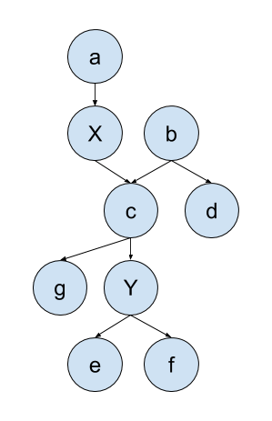
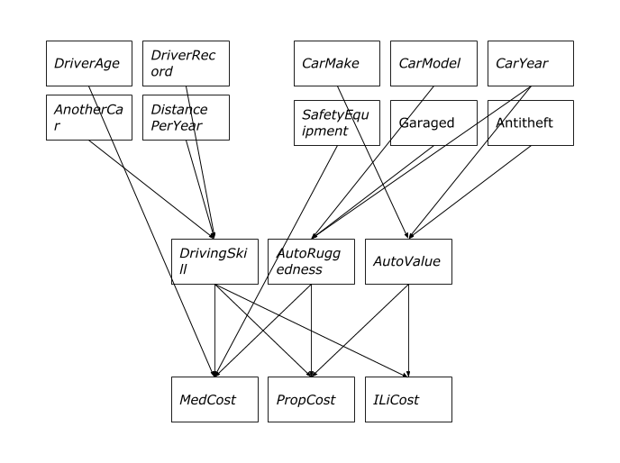
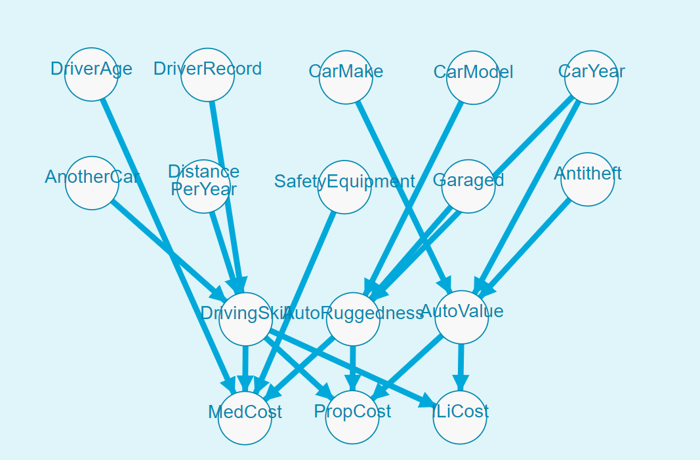

% CS683 Homework 04
% Cen Wang

# Probability

## 1

From the definition of conditional probability, we know

$$P(A \mid B) = \frac{P(A, B)}{P(B)}$$

So, we can write $P(X, Y \mid e)$ as

$$\frac{P(X, Y, e)}{P(e)}$$

Using the definition of conditional probability again, we have

$$P(X, Y, e) = P(X \mid Y, e) P(Y, e)$$

Then

$$
\begin{aligned}
P(X, Y \mid e) & = \frac{P(X, Y, e)}{P(e)} \\
               & = P(X \mid Y, e) \frac{P(Y, e)}{P(e)} \\
               & = P(X \mid Y, e) P(Y \mid e)
\end{aligned}
$$

## 2

Bayes' theorem is

$$P(A \mid B) = \frac{P(B \mid A) P(A)}{P(B)}$$

So $P(Y \mid X, e)$ can be written as

$$\frac{P(X, e \mid Y) P(Y)}{P(X, e)}$$

We proved in the previous question that $P(X, e \mid Y) = P(X \mid Y, e) P(e \mid Y)$. The previous equation can be rewritten as

$$
\begin{aligned}
P(Y \mid X, e) & = \frac{P(X \mid Y, e) P(e \mid Y) P(Y)}{P(X, e)} \\
               & = \frac{P(X \mid Y, e) P(Y, e)}{P(X, e)} \\
               & = \frac{P(X \mid Y, e) P(Y \mid e) P(e)}{P(X \mid e) P(e)} \\
               & = \frac{P(X \mid Y, e) P(Y \mid e)}{P(X \mid e)}
\end{aligned}
$$

# Fake Coin

$P(fake) = \frac{1}{n}$

$P(normal) = 1 - \frac{1}{n}$

$P(head \mid fake)$ = 1

$P(head \mid normal) = \frac{1}{2}$

## 1

$$
\begin{aligned}
P(fake \mid head) & = \alpha P(head \mid fake) P(fake) \\
& = (\alpha)(1)(\frac{1}{n}) \\
& = \frac{\alpha}{n} \\
P(normal \mid head) & = \alpha P(head \mid normal) P(normal) \\
& = (\alpha)(1 / 2)(1 - \frac{1}{n}) \\
\end{aligned}
$$

After normalization, we have $P(fake \mid head) = \frac{2}{n + 1}$.

## 2

$$
\begin{aligned}
P(fake \mid head * k) & = \alpha P(head * k \mid fake) P(fake) \\
& = (\alpha)(1)(\frac{1}{n}) \\
& = \frac{\alpha}{n} \\
P(normal \mid head * k) & = \alpha P(head * k \mid normal) P(normal) \\
& = (\alpha)((\frac{1}{2}) ^ k)(1 - \frac{1}{n}) \\
\end{aligned}
$$

After normalization, we have

$$P(fake \mid head * k) = \frac{2 ^ k}{n + 2 ^ k - 1}$$

## 3

$P(head * k, normal) = P(head * k \mid normal) P(normal) = 2 ^ k (1 - \frac{1}{n})$.

# Bayesian Network

## 1

$2 ^ 8 - 1 = 255$ parameters are needed. We get one free parameter because the parameters must sum to 1.

A: 1
B: 1
C: 2
D: 4
E: 1
F: 2
G: 4
H: 4

The number of parameters needed is 19.

## 2

(a)

Yes. All path from E to G is blocked at H.

(b)

No. CAD is not blocked.

(c)

Yes. The only two paths CAD and CGD are blocked at A and G.

(d)

Yes. There are two paths. BDAC is blocked at D. CGDB is blocked at G.

(e)

Yes. The only path E H CD is blocked at H.

(f)

Yes. There are two paths. F C A D EH is blocked at A. F C G D EH is blocked at G.

(g)

Yes. There are two paths. AC D EH is blocked at D and AC G D EH is blocked at G.

## 3

$$
\begin{aligned}
P(A \mid G) & = \alpha P(A, G) \\
            & = \alpha \sum_{b, c, d} P(A) P(b) P(c \mid A) P(d \mid A, b) P(G \mid c, d) \\
            & = \alpha \sum_{c, d} P(A) P(c \mid A) P(G \mid c, d)  \sum_{b} P(b)  P(d \mid A, b) \\
            & = \alpha \sum_{c, d} P(A) P(c \mid A) P(G \mid c, d) f_1(A, D) \\
            & = \alpha \sum_{c} P(A) P(c \mid A) \sum_{d} P(G \mid c, d) f_1(A, D) \\
            & = \alpha \sum_{c} P(A) P(c \mid A) f_2(A, C, G) \\
            & = \alpha f_3(A, G)
\end{aligned}
$$

# Polytree Network

Let's first derive $P(Y \mid X)$ in the following given Bayesian network.

$$
\begin{aligned}
P(Y \mid X) & = \alpha P(X, Y) \\
            & = \alpha \sum_{a, b, c, d, e, f, g} P(X, Y, a, b, c, d, e, f, g, h) \\
            & = \alpha \sum_{a, b, c, d, e, f, g} P(a) P(X \mid a) P(b) P(c \mid X, b) P(d \mid b) P(g \mid c) P(Y \mid c) P(e \mid Y) P(f \mid Y)
\end{aligned}
$$

We know that $\sum_{f} P(f \mid Y) = 1$, $\sum_{e} P(e \mid Y) = 1$, $\sum_{d} P(d \mid b) = 1$, $\sum_{g} P(g \mid c) = 1$ so the expression can be simplified as

$$
\alpha \sum_{a, b, c} P(a) P(X \mid a) P(b) P(c \mid X, b) P(Y \mid c)
$$

Further, with $\sum_{a} P(a) P(X \mid a) = P(X)$, the expression is simplified to

$$
\alpha \sum_{b, c} P(X) P(b) P(c \mid X, b) P(Y \mid c)
$$

From this result, we know that the nodes influecing the value $P(Y | X)$ is only b and c. The previous polytree is actually a quite general one. We have nodes e, f as Y's children, c as Y's parent and g as Y's parent's child, b as c's parent, d as y's grandparent's child, and a as X's parent. Through our derivation of $P(Y \mid X)$, we find that a, d, g, e, f does not have influence on the value, only b and c has. 

Therefore, an efficient algorithm to compute the quantity is first finding out all Y's ancestors not including X's ancestors (in the above example, $b$ and $c$). Then, we only marginalize over these variables:

$$
\alpha \sum_{z} P(X, Y, z)
$$

where $z$ are ancestors of $Y$ but not $X$.

# Node Removal

There are two situations to remove a node from the network. It's possible that $Y$ is a leaf node and in this case, removing the node from the Bayesian network does not affect anything in the network. When $Y$ has children, we assume that the CPTs for its children can be arbitrarily provided but the CPTs for all other variables should remain the same because otherwise it would be difficult to define all other CPT parameters.

## 1

Let's suppose $X$ is all the nodes that are not $Y$ and $MB(Y)$. Because we have observed all $MB(Y)$, and by definition we know that $Y$ is conditional independent on $X$ given $MB(Y)$. It is also true that $X$ is conditionally independent on $Y$ given $MB(Y)$. Therefore,

$$
\begin{aligned}
P(X \mid Y, MB(Y)) & = P(X \mid MB(Y)) \\
                   & = \alpha P(X, MB(Y)) \\
                   & = \alpha \sum_{z} P(X, MB(Y), z)
\end{aligned}
$$

During the marginalization, we notice that the summation over $z$ all becomes constant. Therefore, removing $Y$ does not have an impact.

## 2

In the previous question, we assumed that removing $Y$ does not change any posterior probability, and does not change $P(X \mid Y, MB(Y))$, so both methods should still work.

# Auto Insurance

## 1

The domains of variables are defined as:

### Driver factors

DriverAge,True(<=55), False(>55)

DriverRecord,True(No Bad record), False(Bad record)

AnotherCar,True(Has Another Car), False(No Another Car) 

Distance PerYear,True(>=2000mile), False(<2000mile) 

### Car factors

CarMake,True(Not Luxury brand), False(Luxury brand) 

CarModel,True(Muscle Car), False(Not Muscle Car) 

CarYear,True(<=5), False(>5) 

SafetyEquipment,True(Has Safety Equipemnt), False(No Safety Equipemnt) 

Garaged,True(Garaged), False(No Garage) 

Antitheft,True(Antitheft), False(No Antitheft) 

### Intermediate variables

DrivingSkill,True(Skilled), False(Not Skilled) 

AutoRuggedness,True(Rugged), False(Not Rugged) 

AutoValue,True(High Value), False(Low Value) 

### Output variables

MedCost,High(about 50k),Medium(about 30k),low(about 10k)

PropCost,High(about 10k),Medium(about 5k),low(about 2k)

ILiCost,High(about 30k),Medium(about 10k),low(about 1k)

## 2

Using the definition in the previous section, we come up with some probable CPTs.

### Driver factors

|                  | t   | f   | 
|------------------|-----|-----| 
| DriverAge        | 0.7 | 0.3 | 
| DriverRecord     | 0.8 | 0.2 | 
| AnotherCar       | 0.3 | 0.7 | 
| Distance PerYear | 0.5 | 0.5 | 

### Driving skills

| DriverRecord,AnotherCar,Distance PerYear | t   | f   | 
|------------------------------------------|-----|-----| 
| ttt                                      | 0.9 | 0.1 | 
| ttf                                      | 0.6 | 0.4 | 
| tft                                      | 0.6 | 0.4 | 
| tff                                      | 0.3 | 0.7 | 
| ftt                                      | 0.6 | 0.4 | 
| ftf                                      | 0.3 | 0.7 | 
| fft                                      | 0.3 | 0.7 | 
| fff                                      | 0.1 | 0.9 | 

### PropCost

| DrivingSkill,AutoRuggedness,AutoValue | high | medium | low | 
|---------------------------------------|------|--------|-----| 
| ttt                                   | 0.1  | 0.3    | 0.6 | 
| ttf                                   | 0.2  | 0.4    | 0.4 | 
| tft                                   | 0.2  | 0.4    | 0.4 | 
| tff                                   | 0.4  | 0.4    | 0.2 | 
| ftt                                   | 0.2  | 0.4    | 0.4 | 
| ftf                                   | 0.4  | 0.4    | 0.2 | 
| fft                                   | 0.4  | 0.4    | 0.2 | 
| fff                                   | 0.6  | 0.3    | 0.1 | 

## 3

Assuming no conditional independence, we need $2 ^ {13} \times 3 ^ 3 - 1$ parameters.

With our network, only $1 \times 10 + 8 \times 3 + 16 \times 2 + 8 \times 2 + 4 \times 2 = 90$ parameters are needed.

# Extra Credit

## 1

We use an online tool from [http://www.cs.man.ac.uk/~gbrown/bayes_nets/](http://www.cs.man.ac.uk/~gbrown/bayes_nets/).

We test our Bayesian network with the data:

Test data: DriverAge<55, No Bad record, Car is Not Luxury brand and Has Safety Equipment

The result of 1000 samples:

Average MedCost:26.24

Average PropCost:5.535

Average ILiCost:13.095

Sum Average Cost:44.87

Test data: Bad record, CarYear>5 years, Car is not Garaged and Has No Antitheft.

The result of 1000 samples:

Average MedCost:31.08

Average PropCost:6.626

Average ILiCost:16.439

Sum Average Cost:54.145

We see that the insurance fee is affordable and also the second insuree, who has a higher risk pays more for his insurance.

## 2

The company has data of evidences like driver’s age and driving record and policy holders ‘ actual cost. This data can be used to learn parameters in Bayes network with methods like Maximum likelihood estimation when network structure is fixed. By learning parameters, the network will fit the company's data and provide reliable probability estimates.

## 3

The simplest way is to use company's previous data to test and show that our model can provide better estimation of policy holders’ cost than the old way. And we can check if using the network earn the company more money while still providing affordable insurance to most people. And company can use more accurate financial risk estimates to gain more.